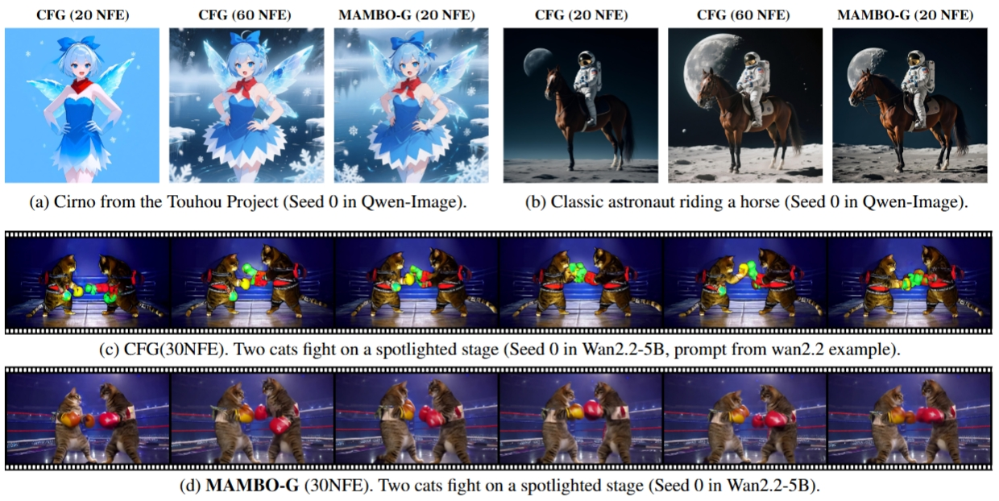
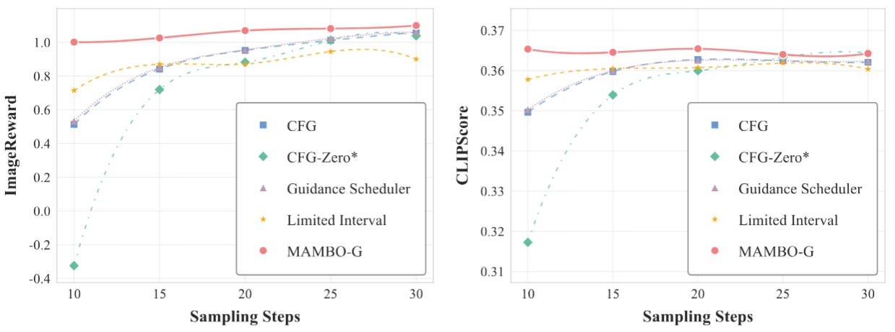
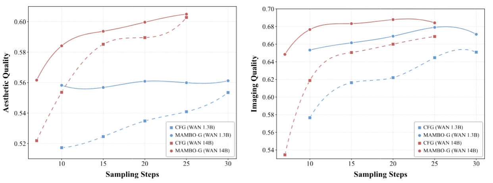

# MAMBO-G: Magnitude-Aware Mitigation for Boosted Guidance

(Building now...)

<p align="center">
    <a href="https://github.com/huggingface/diffusers/pull/12862">
        
    </a>
    <a href="https://arxiv.org/abs/2508.03442v4">
        
    </a>
    <a href="https://matrixteam-ai.github.io/MatrixTeam-OmniVeritas/blog/mambo-g/">
        
    </a>
    <!-- <a href="https://github.com/your-username/MAMBO-G/blob/main/LICENSE">
        
    </a> -->
</p>

**MAMBO-G** is a **training-free**, universal acceleration framework for Classifier-Free Guidance (CFG). By dynamically optimizing guidance magnitudes based on the update-to-prediction ratio, **MAMBO-G** achieves up to **3.0× speedup** on image models (SD3.5, Lumina, Qwen-Image) and **2.0× speedup** on the Wan2.1-14B video model, all while preserving high visual fidelity.

---

## 🚀 News
- **[2026-02]** :tada: **MAMBO-G has been officially merged into the [Hugging Face Diffusers](https://github.com/huggingface/diffusers) library!** You can now use our method natively via the standard library. [Check PR #12862](https://github.com/huggingface/diffusers/pull/12862).
- **[2025-08]** 🎉 **MAMBO-G now supports [Qwen/Qwen-Image](https://huggingface.co/Qwen/Qwen-Image)!** Achieve state-of-the-art text rendering and image generation with 3x speedup.
- **[2025-08]** Preprint paper is available on [arXiv](https://arxiv.org/abs/2508.03442v4).

---

## 💡 Why MAMBO-G?

### Instability at High Guidance
Classifier-Free Guidance (CFG) is a crucial technique for text-to-image and text-to-video generation. However, as we scale up modern diffusion and flow-matching models (e.g., SD3.5, WAN2.1), we notice that simply boosting the guidance scale often backfires. The generation process collapses, yielding images with **oversaturated colors, unnatural high-contrast artifacts, and structural disintegration**. We identify this instability not as a random error, but as a systematic failure mode in high-dimensional latent spaces.

### The "Overshoot" Phenomenon: A Geometric Perspective
Why does strong guidance fail? We trace the root cause to the initialization phase (Zero-SNR, $t=1$). 
1. **Generic Direction at Initialization**: We find that at $t=1$, the input is pure Gaussian noise, meaning it is statistically independent of the target data. Consequently, the model's guidance update vector ($\Delta \mathbf{v}$) relies *solely* on the text prompt, completely ignoring the specific structure of the initial noise.
2. **The Conflict**: Empirically, we observe that the guidance direction is nearly identical (Cosine Similarity $\approx 1.0$) across different random seeds at this initial stage. This indicates that the guidance pushes *every* sample in the exact same "generic" direction.
3. **Manifold Deviation**: In high-dimensional latent spaces, we note that applying a large guidance scale to this generic vector forces the generation trajectory to move aggressively along a path that likely diverges from the optimal path to the data manifold. We term this severe deviation an **"overshoot"**, which drives the state into invalid regions from which the model cannot recover easily.

### The MAMBO-G Solution
To address this "blind" generic guidance, we propose a magnitude-aware adaptive strategy that temporarily dampens the guidance scale when the risk of overshoot is high. We define a **Magnitude-Aware Ratio ($r_t$)**:

$$ r_t(\mathbf{x}_t, t) = \frac{\|\|\mathbf{v}_{\text{cond}}(\mathbf{x}_t, t) - \mathbf{v}_{\text{uncond}}(\mathbf{x}_t, t)\|\|_2}{\|\|\mathbf{v}_{\text{uncond}}(\mathbf{x}_t, t)\|\|_2} $$

We interpret this ratio as a **Coefficient of Variation (CV)** for the diffusion process. It quantifies the relative magnitude of the guidance update (the "variation") with respect to the unconditional prediction (the "mean"). We conclude that a high coefficient implies the guidance force is overwhelming the intrinsic denoising direction, signaling a potential risk of overshoot.

Based on this ratio, we apply an adaptive damping factor to the guidance scale:

$$ w(r_t) = 1 + w_{\max} \cdot \exp(-\alpha r_t) $$

This mechanism ensures that we safely suppress the guidance when the risk is high (typically at the very beginning of sampling) and dynamically restore it as the image structure becomes clearer. 

<div align="center">
  
  <br>
  <em>Superior efficiency of MAMBO-G: Our method achieves comparable quality to 60-NFE (30-step) CFG image generation with only 20 NFE (10 steps), demonstrating a 3.0× speedup over the standard CFG sampling.</b></em>
</div>

---

## ✨ Key Features
- **Plug-and-Play**: No training or fine-tuning required. Works with any pre-trained flow-matching model.
- **Extreme Efficiency**: 2x-4x speedup across SD3.5, Lumina, Qwen-Image, and Wan2.1-14B.
- **Official Support**: Natively integrated into the `diffusers` ecosystem.

---

## 🛠️ Quick Start

### Installation
```bash
git clone https://github.com/your-username/MAMBO-G.git
cd MAMBO-G
pip install -r requirements.txt
```

### Usage (Integrated in Diffusers)
With the official integration, accelerating your pipeline is as simple as injecting the `MagnitudeAwareGuidance` component.

#### 1. Qwen-Image (via Modular Pipeline)
```python
import torch
from diffusers.modular_pipelines import SequentialPipelineBlocks
from diffusers.modular_pipelines.qwenimage import TEXT2IMAGE_BLOCKS
from diffusers.guiders import MagnitudeAwareGuidance

blocks = SequentialPipelineBlocks.from_blocks_dict(TEXT2IMAGE_BLOCKS)
pipeline = blocks.init_pipeline("YiYiXu/QwenImage-modular")
pipeline.load_components(torch_dtype=torch.bfloat16)
pipeline.to("cuda")

# Enable MAMBO-G Accelerated Sampling
guider = MagnitudeAwareGuidance(guidance_scale=10.0, alpha=8.0, guidance_rescale=1.0)
pipeline.update_components(guider=guider)

image = pipeline(
    prompt="A coffee shop entrance with a sign 'Qwen Coffee 😊 $2 per cup'",
    width=1328, 
    height=1328,
    output="images", 
    num_inference_steps=10, 
    generator=torch.Generator("cuda").manual_seed(42)
)[0]
```

### Example Scripts
We provide ready-to-use scripts for evaluating MAMBO-G:
- `sd35_sample.py`: Compare Original vs MAMBO-G for SD3.5.
- `qwen_sample.py`: Compare Original vs MAMBO-G for Qwen-Image.

---

## 📊 Performance Benchmark

<div align="center">
  <br>
  <b>SD3.5 Comparison Results</b>
  <br><br>
  <br>
  <b>Wan2.1 Comparison Results</b>
</div>

---

## 🖼️ Visual Gallery
*(Optional: Add more high-quality result comparisons here)*

---

## ✒️ Citation

If you find this work helpful, please cite our paper:
```
@article{zhu2025mambo,
  title={MAMBO-G: Magnitude-Aware Mitigation for Boosted Guidance},
  author={Zhu, Shangwen and Peng, Qianyu and Shu, Zhilei and Hu, Yuting and Yang, Zhantao and Zhang, Han and Pu, Zhao and Zheng, Andy and Cui, Xinyu and Zhao, Jian and others},
  journal={arXiv preprint arXiv:2508.03442},
  year={2025}
}
```
